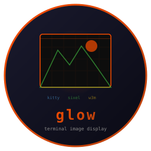

# Glow - Terminal Image Display



    

Display images inline in the terminal using the kitty graphics protocol, sixel, or w3m — and where none of those exist, draw the picture out of text. Auto-detects the best route for your terminal. Feature clone of [termpix](https://github.com/isene/termpix).

Used by [pointer](https://github.com/isene/pointer) for file preview images.

<br clear="left"/>

## Quick Start

```toml
[dependencies]
glow = { version = "0.1", path = "../glow" }
```

```rust
use glow::Display;

let mut display = Display::new();  // Auto-detects protocol
if display.supported() {
    display.show("photo.png", 10, 5, 60, 30);  // x, y, max_w, max_h
    // ... later ...
    display.clear(10, 5, 60, 30, 80, 24);      // Clear region
}
```

## Supported Protocols

| Protocol | Terminals | Detection |
|----------|-----------|-----------|
| **Kitty** | kitty, WezTerm | `TERM=xterm-kitty`, `KITTY_WINDOW_ID`, `TERM_PROGRAM=WezTerm` |
| **Sixel** | xterm, mlterm, foot | `TERM` starts with xterm/mlterm/foot |
| **W3m** | Any X11 terminal | `/usr/lib/w3m/w3mimgdisplay` exists |
| **HalfBlock** | anything with 24-bit colour | `COLORTERM` says truecolor |
| **Chafa** | anything, if installed | `chafa` on PATH |
| **Braille** | anything with a Unicode font | last resort with colour |
| **Ascii** | the Linux console | `TERM=linux` |

`Display::with_mode("halfblock" | "braille" | "chafa" | "ascii" | "kitty" |
"sixel" | "auto" | "off")` forces one.

## Drawing a picture out of text

When no graphics protocol is available, glow draws the image itself. No
subprocess, no external tool: the picture is decoded, scaled and written
in the same process.

**Half blocks** are the default. A cell gets `▀`, the foreground colour
painting the top half and the background the bottom, so every cell
carries two full-colour pixels. Since a cell is about twice as tall as it
is wide, both come out square. On a photograph this is close to what a
graphics protocol gives you.

**Braille** packs 2×4 dots into a cell, at one colour for all eight.
Which dots light is decided by an ordered dither, so the density of ink
inside a cell tracks the brightness there — a fixed threshold loses every
mid-tone, leaving a bright photo empty and a dark one solid.

**Scaling happens in linear light.** Averaging sRGB bytes directly makes
every downscale come out darker than the original: half black and half
white gives 128 that way, where the honest answer is 188. glow converts
to linear, box-averages the source rectangle each output pixel covers,
and converts back.

Try them side by side:

```sh
cargo run --release --example show -- halfblock photo.jpg 100 34
cargo run --release --example show -- braille   photo.jpg 100 34
```

## API

```rust
pub struct Display { ... }

impl Display {
    pub fn new() -> Self;                    // Auto-detect protocol
    pub fn supported(&self) -> bool;         // Check if display works
    pub fn protocol(&self) -> Option<Protocol>; // Which protocol

    pub fn show(&mut self,
        image_path: &str,                    // Path to image file
        x: u16, y: u16,                     // Character position
        max_width: u16, max_height: u16     // Max size in chars
    ) -> bool;                               // Success

    pub fn clear(&mut self,
        x: u16, y: u16,                     // Region position
        width: u16, height: u16,            // Region size
        term_width: u16, term_height: u16   // Terminal size
    );
}
```

## How It Works

- **Kitty**: Scales image with ImageMagick `convert`, base64 encodes, transmits in 4KB chunks via escape sequences. Caches processed images by path+dimensions+mtime.
- **Sixel**: Uses `convert` to generate sixel output directly.
- **W3m**: Calculates pixel coordinates from cell size, communicates with `w3mimgdisplay`.
- **HalfBlock / Braille**: decoded and scaled in-process by the `image`
  crate, with ImageMagick only as a fallback for formats it cannot read
  (HEIC, SVG, odd CMYK JPEGs).

## Runtime Requirements

- **ImageMagick** (`convert`) - required for kitty and sixel protocols
- **w3mimgdisplay** - required for w3m protocol only
- **xdotool** + **xwininfo** - required for w3m protocol only
- The text renderers need nothing at all for PNG / JPEG / GIF / WebP /
  BMP / TIFF

## Part of the Fe2O3 Rust Terminal Suite

See the [Fe₂O₃ suite overview](https://github.com/isene/fe2o3) and the [landing page](https://isene.org/fe2o3/) for the full list of projects.

| Tool | Clones | Type |
|------|--------|------|
| [rush](https://github.com/isene/rush) | [rsh](https://github.com/isene/rsh) | Shell |
| [crust](https://github.com/isene/crust) | [rcurses](https://github.com/isene/rcurses) | TUI library |
| **[glow](https://github.com/isene/glow)** | **[termpix](https://github.com/isene/termpix)** | **Image display** |
| [plot](https://github.com/isene/plot) | [termchart](https://github.com/isene/termchart) | Charts |
| [pointer](https://github.com/isene/pointer) | [RTFM](https://github.com/isene/RTFM) | File manager |

## License

[Unlicense](https://unlicense.org/) - public domain.

## Credits

Created by Geir Isene (https://isene.org) with extensive pair-programming with Claude Code.
